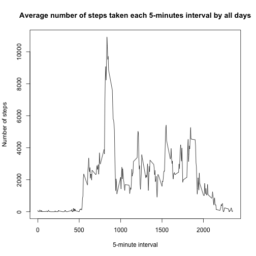

Peer-graded Assignment: Course Project 1
========================================

##Loading and preprocessing the data

Here we load the needed database for the assignment.

```r
library(lubridate)
library(ggplot2)
knitr::opts_chunk$set(echo = TRUE)
setwd("/Users/daniillebedev/Desktop/Reproducible research/")
data <- read.csv('activity.csv')
```

##What is mean total number of steps taken per day?

Now we will calculate mean total number of steps taken per day and provide a histogram with total number of steps distribution.  

```r
agg_st <- aggregate(steps ~ date, data, FUN=sum)
st_mean <- mean(agg_st$steps)
st_median <- median(agg_st$steps)
```


```r
st_mean
```

```
## [1] 10766.19
```

```r
st_median
```

```
## [1] 10765
```
As we see, the mean total number of steps taken per day is **10766.19**. 
While the median is equal to **10765**.


The histogram shows total number of steps taken per day:

```r
hist(agg_st$steps, main = "Total number of steps taken per day", xlab = "Frequency", ylab = "Number of steps")
```


##What is the average daily activity pattern?

First we need to make a time series plot of the 5-minute interval and the average number of steps taken, averaged across all days.


```r
agg_int <- aggregate(steps ~ interval, data, FUN=sum)
int <- agg_int$interval
stp <-agg_int$steps
plot(int, stp, type = "l", main = "Average number of steps taken each 5-minutes interval by all days", xlab = "5-minute interval", ylab = "Number of steps")
```



Now we will find which 5-minute interval, on average across all the days in the dataset, contains the maximum number of steps:

```r
agg_int[stp== max(stp), ]
```

```
##     interval steps
## 104      835 10927
```

As we see the needed interval is **835**.

##Imputing missing values

First, we need to calculate the total number of missing values in the dataset:

```r
summary(is.na(data))
```

```
##    steps            date          interval      
##  Mode :logical   Mode :logical   Mode :logical  
##  FALSE:15264     FALSE:17568     FALSE:17568    
##  TRUE :2304
```

As we see there are **2304** rows with missing data on number of steps.

Second, we need to impute missing data and create a new dataset that is equal to the original dataset but with the missing data filled in. I propose to use median number of steps for a day to impute missing data on number of steps. 

```r
agg_int <- aggregate(steps ~ date, data, FUN=median)
data_1 <- merge(x=data, y=agg_int, by="date")
data_1$steps <- ifelse(is.na(data_1$steps.x), data_1$steps.y, data_1$steps.x)
summary(is.na(data_1))
```

```
##     date          steps.x         interval        steps.y       
##  Mode :logical   Mode :logical   Mode :logical   Mode :logical  
##  FALSE:15264     FALSE:15264     FALSE:15264     FALSE:15264    
##    steps        
##  Mode :logical  
##  FALSE:15264
```

As a result we can see that there are no missing data left in the dataset and the summary on the new dataset is provdided below:

```r
summary(data_1)
```

```
##          date          steps.x          interval         steps.y 
##  2012-10-02:  288   Min.   :  0.00   Min.   :   0.0   Min.   :0  
##  2012-10-03:  288   1st Qu.:  0.00   1st Qu.: 588.8   1st Qu.:0  
##  2012-10-04:  288   Median :  0.00   Median :1177.5   Median :0  
##  2012-10-05:  288   Mean   : 37.38   Mean   :1177.5   Mean   :0  
##  2012-10-06:  288   3rd Qu.: 12.00   3rd Qu.:1766.2   3rd Qu.:0  
##  2012-10-07:  288   Max.   :806.00   Max.   :2355.0   Max.   :0  
##  (Other)   :13536                                                
##      steps       
##  Min.   :  0.00  
##  1st Qu.:  0.00  
##  Median :  0.00  
##  Mean   : 37.38  
##  3rd Qu.: 12.00  
##  Max.   :806.00  
## 
```


Now we will calculate mean total number of steps taken per day and provide a histogram with total number of steps distribution for a new database with no missing data.


```r
agg_st_1 <- aggregate(steps ~ date, data_1, FUN=sum)
st_mean_1 <- mean(agg_st_1$steps)
st_median_1 <- median(agg_st_1$steps)
```


```r
st_mean_1
```

```
## [1] 10766.19
```

```r
st_median_1
```

```
## [1] 10765
```
As we see, the mean total number of steps taken per day is **10766.19**. 
While the median is equal to **10765**.


The histogram shows total number of steps taken per day:

```r
hist(agg_st_1$steps, main = "Total number of steps taken per day", xlab = "Frequency", ylab = "Number of steps")
```


Do these values differ from the estimates from the first part of the assignment? What is the impact of imputing missing data on the estimates of the total daily number of steps?

These values do not differ much from the estimates based on data with some missing data.  
The impact of imputing missing data on the estimates of the total daily number of steps is *small*.

##Are there differences in activity patterns between weekdays and weekends?

Creating a new factor variable in the dataset with two levels ??? 'Weekday' and 'Weekend' indicating whether a given date is a weekday or weekend day:

```r
data_1$day <- wday(data_1$date)
data_1$dayw <- ifelse(data_1$day>5, "Weekend", "Weekday")
```

Making a panel plot containing a time series plot of the 5-minute interval and the average number of steps taken, averaged across all weekday days or weekend days:


```r
agg_st_2 <- aggregate(steps ~ date + dayw + interval, data_1, FUN=mean)
head(agg_st_2)
```

```
##         date    dayw interval steps
## 1 2012-10-02 Weekday        0     0
## 2 2012-10-03 Weekday        0     0
## 3 2012-10-04 Weekday        0    47
## 4 2012-10-07 Weekday        0     0
## 5 2012-10-09 Weekday        0     0
## 6 2012-10-10 Weekday        0    34
```

```r
ggplot(agg_st_2, aes(x=interval, y=steps)) + 
  geom_line(color="green", size=0.7) + 
  facet_wrap(~dayw, nrow=2) +
  labs(title="Average number of steps taken each 5-minute intervals, averaged across all weekday days and weekend days", x="5-minute time interval", y="Number of steps")
```


